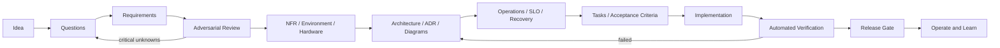

# System Development OS

アイデアや軽い要件から、仕様、設計、実装、検証、リリース、運用までを一貫して進めるための共通テンプレートです。AIコーディングエージェントにすぐ実装させず、判断と検証可能な成果物を先に残すことで手戻りを減らします。

## 基本原則

- 仕様を正本とし、コード、テスト、図、運用資料を追従させる。
- 事実、仮説、希望、制約、未確定事項を分離する。
- 実装前に運用、障害、復旧、環境、ハードウェアを検討する。
- 問題点を探す役と実装する役を分ける。
- 図はMermaidまたはStructurizr DSLでコードとして管理する。
- 未確認を合格扱いしない。

## クイックスタート

1. このリポジトリをテンプレートとして新しいプロジェクトを作成する。
2. `docs/00-intake/IDEA.md`へアイデアを記入する。
3. `prompts/idea-refiner.md`で質問と前提を整理する。
4. `prompts/requirements-architect.md`で要求と受入条件を作成する。
5. `prompts/adversarial-reviewer.md`で問題点を洗い出す。
6. アーキテクチャ、環境、運用を設計する。
7. `docs/03-delivery/TRACEABILITY.md`で要求から検証までを結ぶ。
8. `python scripts/validate.py`を実行する。

## プロジェクト規模

|プロファイル|対象|必須成果物|
|---|---|---|
|Light|小変更、短期検証|IDEA、受入条件、タスク、テスト結果|
|Standard|通常の製品・業務システム|全要求、ADR、図、環境表、Runbook、SLO|
|Regulated|機密、医療、金融、重要インフラ、HW連携|Standardに加え脅威分析、監査証跡、復旧試験、承認記録|

詳細は[`docs/PROJECT_PROFILE.md`](docs/PROJECT_PROFILE.md)を参照してください。

## 標準フロー

## ディレクトリ

- `docs/00-intake`: アイデア、質問、仮定
- `docs/01-product`: PRD、要求、非機能要件、受入条件
- `docs/02-architecture`: C4、ADR、データ、連携、図
- `docs/03-delivery`: ロードマップ、タスク、トレーサビリティ
- `docs/04-quality`: テスト、セキュリティ、環境・ハードウェア
- `docs/05-operations`: SLO、監視、Runbook、復旧、インシデント
- `prompts`: エージェント用プロンプト
- `scripts`: リポジトリ検証スクリプト

## 完了の定義

変更は、要求、受入条件、テスト、図、ADR、運用資料、ロールバック方針が必要な範囲で同時に更新され、CIが成功した時にのみ完了です。

