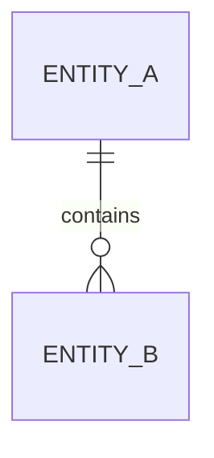

# Data and Integrations

## Data model

```mermaid
erDiagram
  ENTITY_A ||--o{ ENTITY_B : contains
```

## API and event contracts

|契約|提供者|利用者|バージョン|互換性|再試行|冪等性|
|---|---|---|---|---|---|---|
|||||||

## Migration

- 移行元:
- 検証:
- 切り戻し:
- データ照合:

