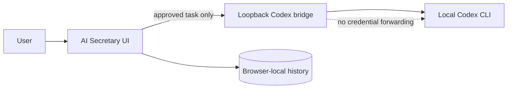

# System Context

## Purpose and boundary

AI Secretary is a local-first UI. It owns presentation and user-managed browser data. A future loopback-only bridge owns the narrow, approved integration with Codex CLI; it does not expose a network listener outside the computer.

## Actors and systems

| Actor / system | Responsibility | Boundary |
|---|---|---|
| User | Chooses avatar, chats, approves or cancels tasks | Trusted human approval |
| AI Secretary UI | Renders avatar, histories, and task approvals | Browser-local data |
| Local Codex bridge | Validates and runs approved task request | Loopback process boundary |
| Codex CLI | Performs approved coding/work task | Own credential and tool boundary |

## Key flows

1. User enters a message. UI appends it to the selected chat locally.
2. User drafts a work task. UI shows it in the Work log as pending.
3. Only after explicit approval does the bridge receive a one-time request.
4. Bridge streams a sanitized status/transcript back to the UI; failed or cancelled tasks remain visible.

## Trust boundaries

- User to UI: browser content is untrusted input.
- UI to bridge: loopback only, origin checked, one-time approval token, no arbitrary shell command field.
- Bridge to Codex: Codex controls its own account/session and any tool approvals.

## Open architecture decisions

- ADR-0001: use a local CLI bridge rather than embedding or forwarding Codex credentials.
- ADR-0002: select storage and encryption before first production release.
