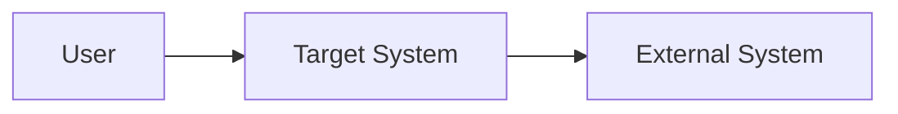

# System Context

## Purpose and boundary

## Actors and systems

|要素|種類|責任|所有者|信頼境界|
|---|---|---|---|---|
|||||

```mermaid
flowchart LR
  User[User] --> System[Target System]
  System --> External[External System]
```

## Key flows

## Trust boundaries

## Open architecture decisions

