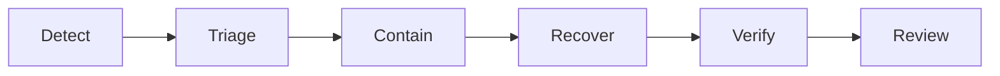

# Incident Response

## Severity

|Severity|Definition|Response target|Update cadence|
|---|---|---|---|
|SEV-1||||
|SEV-2||||
|SEV-3||||

## Roles

- Incident commander:
- Operations:
- Communications:
- Subject matter expert:
- Scribe:

## Flow

## Communication templates

## Post-incident review

- Timeline:
- User impact:
- Root and contributing causes:
- What worked/failed:
- Corrective actions with owners and dates:

